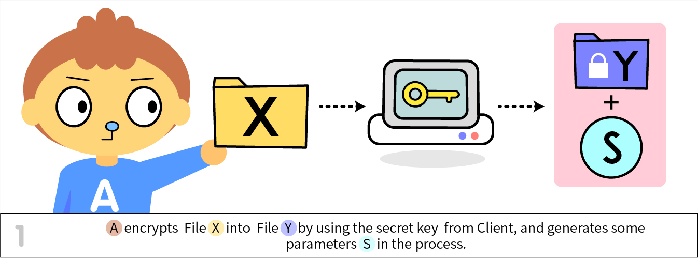
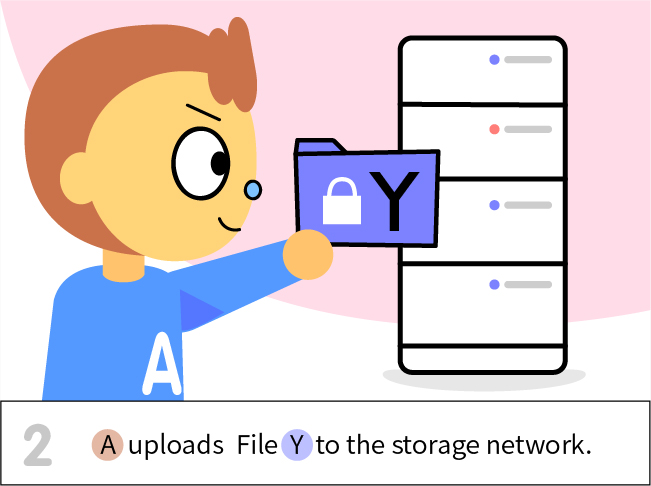
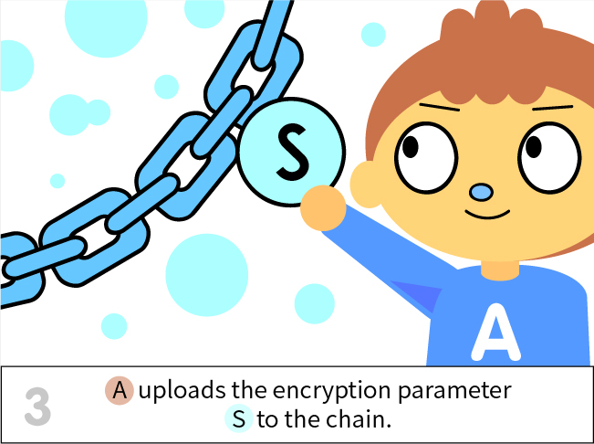
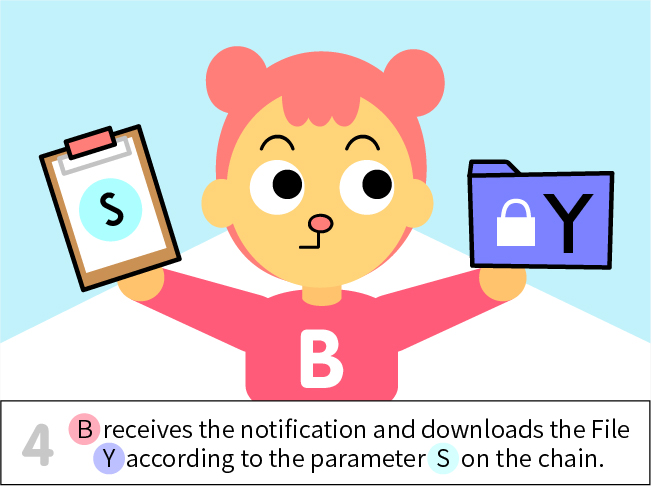
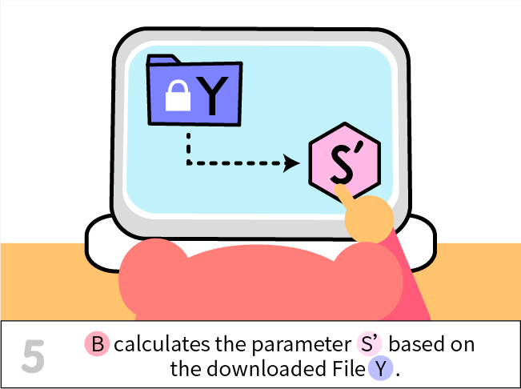
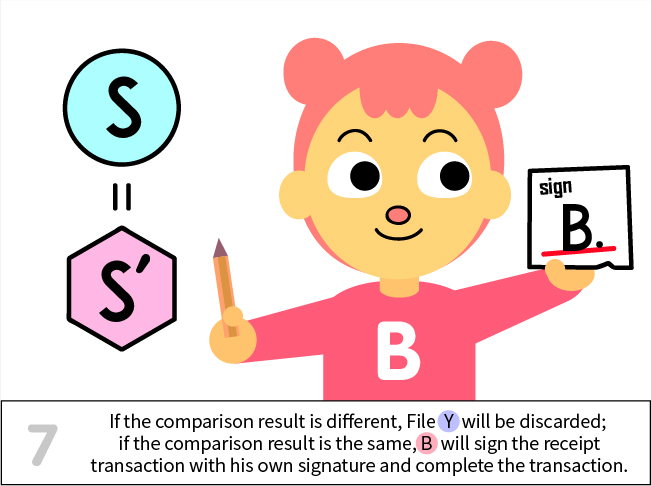
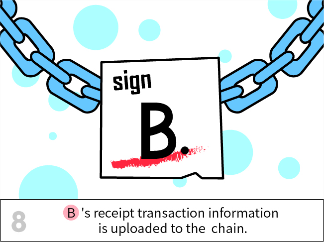
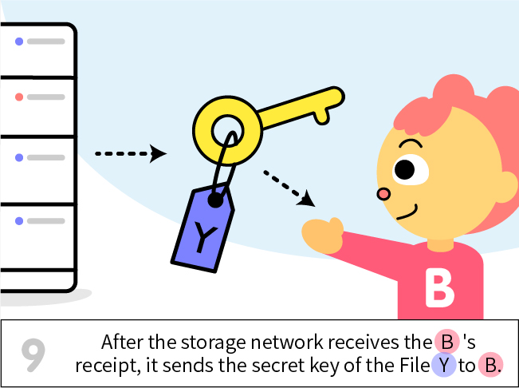
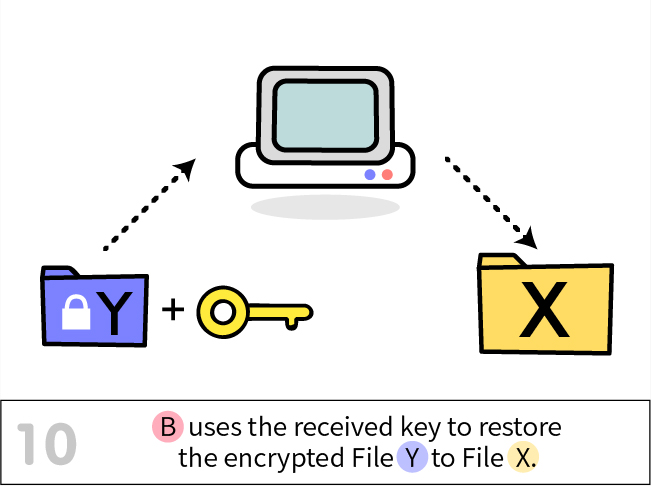
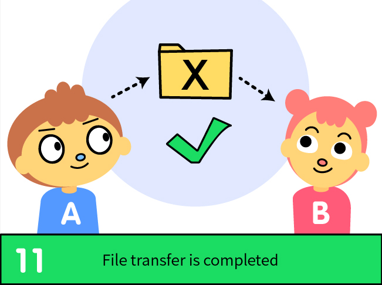

# ELI5 -- Genaro
The Document is about to describe how to use Genaro, and how to join the Genaro sharing community.

Be sure that you have this sub-repo, and this library is a must for using sharing
<https://github.com/GenaroNetwork/libgenaro/tree/mail>

### It starts with encryption

### Then the file is on receiver's bucket

### Well, it's time for you to confirm

### Now, start your decryption

### Congrats, you two finish the sharing

